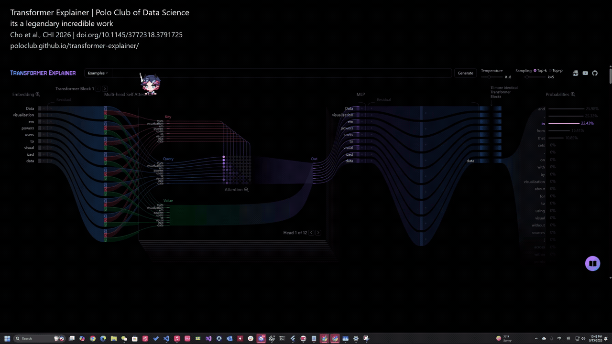
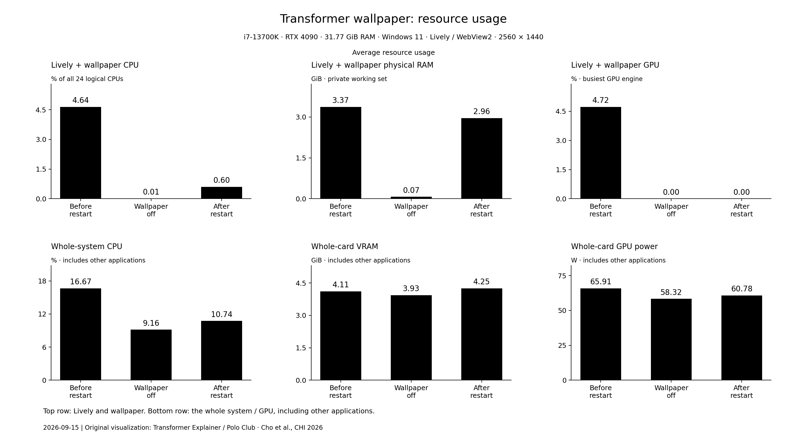

# Put a Transformer into Your Wallpaper

Use [Transformer Explainer](https://poloclub.github.io/transformer-explainer/) as an interactive Windows 11 desktop wallpaper, centered on your screen, with **black and white themes**.

All visualization and model credit belongs to the original **[Transformer Explainer team / Polo Club](https://github.com/poloclub/transformer-explainer)**.

> its a legendary incredible work

This independent project provides the Lively wrapper, centering, themes, installation guide, and a **fully local webpage + NVIDIA CUDA inference mode**. It does not claim authorship of Transformer Explainer and is not an official affiliated project. See [CITATION.bib](CITATION.bib) for the original paper and [CREDIT.md](CREDIT.md) for full attribution.

## Demo

[](https://github.com/IceKKKKKKKKKKK/transformer-explainer-wallpaper/raw/refs/heads/main/media/demo.mp4)

[Watch or download the 64-second MP4](https://github.com/IceKKKKKKKKKKK/transformer-explainer-wallpaper/raw/refs/heads/main/media/demo.mp4). This updated user-recorded clip shows the **local GPT-2 / CUDA version** on the Windows 11 desktop, with the bottom taskbar visible throughout. It preserves the supplied recording's duration, playback speed, and audio, with attribution and the paper citation added above the visualization. See [recording details and credits](media/README.md).

## Install with Codex

You need Windows 11, an NVIDIA GPU, Python 3.11/3.12, Node.js 22+, Git, and **Codex running locally on that computer with terminal and Windows UI access**. Copy either prompt below. Replace "Windows display 1" with your preferred screen.

**Black theme:**

```text
Clone https://github.com/IceKKKKKKKKKKK/transformer-explainer-wallpaper and read AGENTS.md. Install the fully local webpage and original model using the NVIDIA CUDA backend in LOCAL_GPU.md, enable its startup, complete the Lively setup, then apply the black Transformer Explainer wallpaper to Windows display 1. Verify the display mapping, preserve the other screens, enable working mouse and keyboard interaction without duplicate key forwarding, caching, and startup, and test typing and generation on the actual desktop. Do not restart Windows automatically.
```

**White theme:**

```text
Clone https://github.com/IceKKKKKKKKKKK/transformer-explainer-wallpaper and read AGENTS.md. Install the fully local webpage and original model using the NVIDIA CUDA backend in LOCAL_GPU.md, enable its startup, complete the Lively setup, then apply the white Transformer Explainer wallpaper to Windows display 1. Verify the display mapping, preserve the other screens, enable working mouse and keyboard interaction without duplicate key forwarding, caching, and startup, and test typing and generation on the actual desktop. Do not restart Windows automatically.
```

Without desktop control, Codex can prepare the files, but you will need to help with ZIP import and the final interaction check. A cloud Codex session cannot directly configure another computer's Windows desktop.

## Manual installation

1. Clone this repository, then run `./scripts/Install-LocalGpu.ps1 -EnableStartup` in PowerShell. This downloads the webpage, original model, tokenizer, and isolated CUDA runtime. See [local GPU setup](LOCAL_GPU.md) for prerequisites and start/stop commands. Install the official [Lively Wallpaper](https://www.rocksdanister.com/lively/).
2. Download the [black ZIP](https://github.com/IceKKKKKKKKKKK/transformer-explainer-wallpaper/raw/refs/heads/main/dist/Transformer-Explainer-black.zip) or [white ZIP](https://github.com/IceKKKKKKKKKKK/transformer-explainer-wallpaper/raw/refs/heads/main/dist/Transformer-Explainer-white.zip). In Lively, use **Add Wallpaper → Choose a file** to import the ZIP.
3. Select your screen, use **Per Screen**, and choose **WebView2** as the web player. Start with **Mouse** input mode and enable disk caching. Wait for the **Model** and **Inference · CUDA** status to appear, click the prompt to focus it, type, and click **Generate**. Check the troubleshooting section if typing fails or duplicates.

Use **Customize Wallpaper** to switch the theme or adjust the webpage height and vertical offset. The default frame is 900 px high and centered on a 2560 × 1440 display; adjust it for your own screen.

- Black uses CSS inversion with hue compensation, so colors differ slightly from the original. White preserves the upstream appearance.
- Lively documents duplicate keystrokes when **Keyboard** forwarding and direct wallpaper focus both receive the same key. Use **Mouse** mode with WebView2 when this happens; the focused webpage can receive typing directly. Keyboard mode also hides desktop icons globally. Verify typing on the actual desktop because behavior varies by Lively/WebView2 version.
- Installation requires internet once. Afterward, the webpage and model run locally at `http://127.0.0.1:8765/`; the browser no longer downloads the 626 MiB model after each restart. NVIDIA CUDA performs model inference. Reference links still require internet when opened. The ZIPs require the separately installed local service.
- Configure startup, fullscreen pausing, and continued playback behind ordinary windows in Lively Settings.

## Current desktop UI

The local page omits the top-left title and the PDF/YouTube/GitHub header shortcuts. Original author credits and paper links remain in the article and this repository. The status area shows the running service's **GPT-2 small (124M)** model and **CUDA / GPU name** on two lines, enlarged to 22 px and 18 px. Both themes use the same interface and backend.

## Use GPU inference

Run these commands from the cloned repository in PowerShell:

```powershell
# First installation; also enables the local service at sign-in.
./scripts/Install-LocalGpu.ps1 -EnableStartup

# On later runs, start or check the existing service.
./scripts/Start-LocalGpu.ps1
Invoke-RestMethod http://127.0.0.1:8765/api/health |
    Select-Object ready, model_display, device, provider, cuda_matmul_verified
```

Require `ready=True`, `provider=CUDAExecutionProvider`, and `cuda_matmul_verified=True`. Then focus the wallpaper's prompt, enter text, and click **Generate**. The status displays the model and your detected GPU; it does not require a cloud API key. The original ONNX model stays local, and startup verifies real CUDA matrix multiplication instead of relying only on an installed GPU driver. If CUDA cannot initialize, startup fails visibly rather than silently switching to CPU-only inference.

Diagram layout and JavaScript animation logic still use the CPU; WebView2 can accelerate browser compositing with the GPU. This is separate from CUDA inference. See [LOCAL_GPU.md](LOCAL_GPU.md) for prerequisites, offline behavior, start/stop commands, and validation limits.

For an existing installation, update the checkout, stop the old service, and rebuild the local frontend before reapplying the wallpaper:

```powershell
git pull --ff-only
./scripts/Stop-LocalGpu.ps1
./scripts/Install-LocalGpu.ps1 -EnableStartup
```

Then close and reapply the registered wallpaper on its current monitor in Lively, and check the model/CUDA status again. Preserve other monitor assignments. If the repository has your own edits, resolve those before pulling.

## Resource usage

**Historical measurement: these charts describe the earlier remote webpage / browser CPU (WASM) version, before the local CUDA migration. They are not measurements of the new GPU service.**



Measured on September 15, 2026 with an **i7-13700K, RTX 4090, 32 GB RAM**, Windows 11, and the black wallpaper at **2560 × 1440** in Lively 2.2.1.0 / WebView2. Each state was observed for 90 seconds, sampled every 2 seconds; the bars show averages after the first 4 seconds of samples were excluded.

The wallpaper added approximately **2.9–3.3 GiB of private physical RAM** above the off baseline. Lively and its wallpaper processes averaged **4.64% CPU in the existing session** and **0.60% after reopening and loading a fresh session**. CPU percentages cover all 24 logical CPUs. "Wallpaper off" keeps the Lively host running; "restart" means reopening this wallpaper. The existing and fresh sessions had different prompt/tutorial states.

The top row measures Lively and its wallpaper subprocesses. The bottom row includes other applications, so its changes cannot be attributed entirely to the wallpaper. This was a short idle-desktop test on one machine; continuous generation and game frame rates were not tested.

[Download the bar chart as PDF](media/performance-charts.pdf) · [SVG](media/performance-overview.svg)

## If the prompt will not accept text

If each key appears twice, switch **Settings → Wallpaper → Wallpaper input** from **Keyboard** to **Mouse**, then click the prompt again. This is the [official workaround for duplicate key forwarding](https://github.com/rocksdanister/lively/releases).

If no text appears, check **Generate** first. The upstream app disables editing while its model is loading, while a diagram block is expanded, or while a weight popover is open. Mouse exploration can still work during model loading. Close expanded details and wait until the local connection message disappears and Generate becomes enabled; enabling Lively's Keyboard setting alone does not unlock the field.

If loading stays stuck, keep the wallpaper running without fullscreen pausing during initialization, then close and reapply only that wallpaper in Lively. Preserve existing caches. Restore your normal fullscreen pause rule afterward. Confirm readiness on the actual desktop, since Preview uses a separate browser profile and can work while the desktop instance is still stuck.

The earlier remote version used a credentialless iframe to work around a WebView2 cached-model Blob failure. The current local version loads the model in a separate CUDA service, so the browser no longer constructs that large model Blob. If the **Model** and **Inference · CUDA** status does not appear, run `./scripts/Start-LocalGpu.ps1` and check `.runtime/server.stderr.log`; then reload the page or reapply the wallpaper.

Once ready, click the prompt and leave the pointer on the wallpaper's monitor while typing. If Keyboard forwarding is needed on your host, Lively routes forwarded keys to the monitor under the pointer and only forwards them when the Windows desktop has focus; test for duplicate characters before keeping that mode. Chinese IME input also has a [known upstream limitation](https://github.com/rocksdanister/lively/issues/316); test plain English separately.

## If the mouse pointer disappears after typing

A [WebView2 issue reported with Runtime 152](https://github.com/MicrosoftEdge/WebView2Feedback/issues/5708) can leave the pointer hidden after typing. For this symptom, disable **Control Panel → Mouse → Pointer Options → Hide pointer while typing**. The equivalent reversible helper is:

```powershell
./scripts/Fix-MousePointer.ps1 -CheckOnly
./scripts/Fix-MousePointer.ps1
# Optional: restore the preference saved before the first application.
./scripts/Fix-MousePointer.ps1 -Restore
```

This changes one preference for the **current Windows user across all applications**. It saves the original value in `%LOCALAPPDATA%/TransformerExplainerWallpaper/pointer-preference.json` and verifies the new value through the Windows API. It does not alter your cursor theme or Lively's input forwarding. The installer does not apply this workaround automatically. After applying it, type in the wallpaper and move the pointer across the controls; if an existing WebView2 instance stays stuck, close and reapply only the affected wallpaper.

## Development

The local backend is in `local/server.py`; `local/prepare.py` patches the pinned upstream frontend. See [LOCAL_GPU.md](LOCAL_GPU.md). Edit the presentation wrapper in `src/index.html`, then run `powershell -File scripts/Build-Packages.ps1` to build both importable ZIPs. The repository contains no personal display configuration, caches, or model weights.

Wallpaper wrapper: MIT. Upstream attribution and license: [THIRD_PARTY_NOTICES.md](THIRD_PARTY_NOTICES.md). Installation details follow [Lively's documentation](https://github.com/rocksdanister/lively/wiki).
